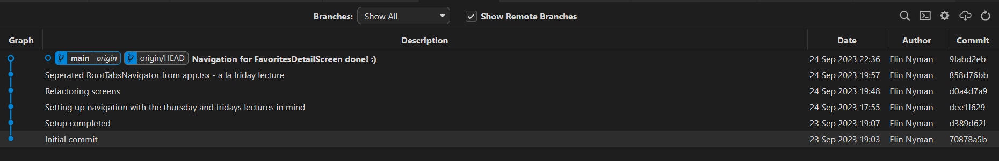

## CapyFacts

The first assignment in the course 'App Development' with David Jensen as part of the System Developer.NET program at Yrkeshögskolan i Borås, SUVNET22

## Idiocy at an elite level

I messed up big time, so I had to start a new repo. Here are the previous git commits. I copied the workflow to this repo, but, well... here's a nice picture of it:

## arrayChunk

Heres a mix-match for making the arrayChunk in FavoritesScreen.tsx

- https://medium.com/@matt.readout/chunking-an-array-in-javascript-831150bb6c7
- https://developermemos.com/posts/chunking-array-typescript

## React Native Components used in this app:

1. `View`
2. `Text`
3. `TouchableOpacity`
4. `StyleSheet`
5. `SafeAreaProvider`
6. `FlatList`
7. `TextInput`

## Expo SDK used in this app:

1. `Image`
2. `Statusbar`
3. `AsyncStorage`
4. `LinearGradient`
5. `Sms`

## Third module used in this app:

1. `Card, Button, Modal`from @react-native-paper;

## Krav för godkänt:

[x] Projektet använder minst 4 stycken RN-komponenter och minst 4 stycken Expo
komponenter.
[x] De utvalda komponenterna MÅSTE antecknas i README filen tillsammans med en
lista över genomförda krav.
[x] React Navigation används för att skapa en bättre upplevelse i appen.
[x] Git & GitHub har använts
[x] Projektmappen innehåller en README.md fil - (läs ovan för mer info)
[x] Uppgiften lämnas in i tid!
[x] Muntlig presentation är genomförd

## Krav för väl godkänt:

[x] Alla punkter för godkänt är uppfyllda
[x] Ytterligare en valfri extern modul används i projektet.
[x] Appen ska prata med ett Web-API för att hämta data.
[?] Appen ska laseras på en Appstore (Deadline samma dag som kursen slutar)
